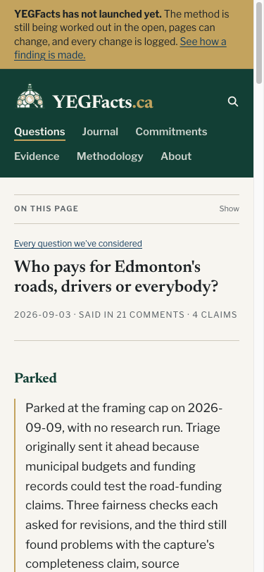

# Road-funding park disclosure review

Date: 2026-10-04. Independent reviewer: GPT-5.6 Sol explorer, separate
from the coordinating and editing session. This is a status disclosure,
not a framing report or a finding about road funding.

## Result

The register change matches the existing parked brief, September 9 trace
audit and September 24 confirmation-ineligibility record. It makes the
question Briefed, Parked and unpublished without reopening it. Historical
intake GO and all captured claims and substantive review artifacts remain
unchanged.

The first independent read caught an unrelated promise on unpublished
question pages that every claim was checked. That sentence now says every
claim is listed here. The reviewer approved the corrected diff on evidence
compliance and plain speech.

## Rendered check

The independent reviewer inspected the built question and index on desktop
at 1440 by 1000 and on a phone viewport at 375 by 812. The Parked heading,
reason, state rows and claim listing were readable without overflow,
clipping or an implied finding. The index showed Parked rather than Going
ahead. No required finding remained. The coordinating session separately
inspected the phone screenshot.

## Local checks

Validation, type checking, build, exposure audit, duplication audit and
sitemap audit passed. Unit tests passed with 672 tests and one skipped.
The duplication audit retained 72 cross-page warnings and no fail-class
finding; validation retained existing readability and fetched-source
warnings. The committed diff also passed `npm run validate:diff`.

The scoped simplification pass ran on Claude Opus 5.5. Its sole suggestion
was to remove a sentence describing this edit from the register note; that
sentence belongs here instead and was removed. No logic, layout, schema,
model pin, synthesis rule or publication gate changed.
