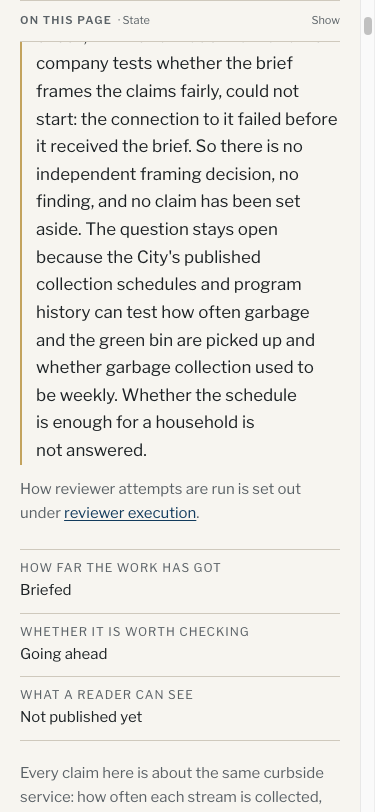

# Waste review paused before framing — closeout verification

Date: 2026-10-04. This batch publishes the intake, draft brief and execution
block, not a finding or an adopted framing park. The brief remains unfrozen.
The attempt chronology and resume instructions are in [run-record.md](../run-record.md).

## Independent rendered critique

A separate GPT-5.6 Sol explorer inspected the question page at 1440 × 1000
and 375 × 812, its entry in the question index, and the phone's intake
accordion. This was a read-only presentation review, not a framing report
or panel seat.

The reviewer required one correction: the paused-review link caption
promised that the methodology explained how to resolve the current
connection failure. It instead describes reviewer safeguards. The caption
now says how reviewer attempts are run. The rebuilt page passed the recheck.

The states are Briefed, Going ahead and Not published yet. The pause reason
says there is no framing decision or finding, no claim has been set aside,
and household adequacy remains unanswered. The reviewer found no misleading
finding or park cue, horizontal overflow, clipping or overlap. The phone
accordion opened cleanly. No required findings remain.

## Repository and preservation checks

Validation, type check, build and committed-diff validation passed on the
closeout. The caption correction was rebuilt and inspected independently.
Tests passed on the unchanged editorial checkpoint: 41 files, 672 tests
passed and one skipped. No new test was added for the copy-only correction.

Exposure, duplication and sitemap audits passed. Exposure retained the
main checkout's 91 PII warnings, with no new scoped warning or fail-class
finding. Duplication retained 72 existing cross-page warnings and no
fail-class finding. Existing readability and source-access validation
warnings were unchanged. The sitemap matched all 581 indexable pages.
No unrelated warning was changed in this batch.

The coordinator independently checked all four retained attempt records:
three research launches and one diagnostic, each refused with zero captured
requests. No framing report exists. The intake and brief hashes still match
the pre-framing checkpoint; every claim row is unchanged.

All eleven new immutable source archives were copied to the main checkout
and SHA-256 verified. Closed editorial logs and the exact framing package
remain private. The archive-safe removal script copies them to the main
checkout before removing the worktree. Central reviewer-attempt archives are
retained outside the worktree. No model pin, launcher setting, synthesis rule or publication gate
changed.
